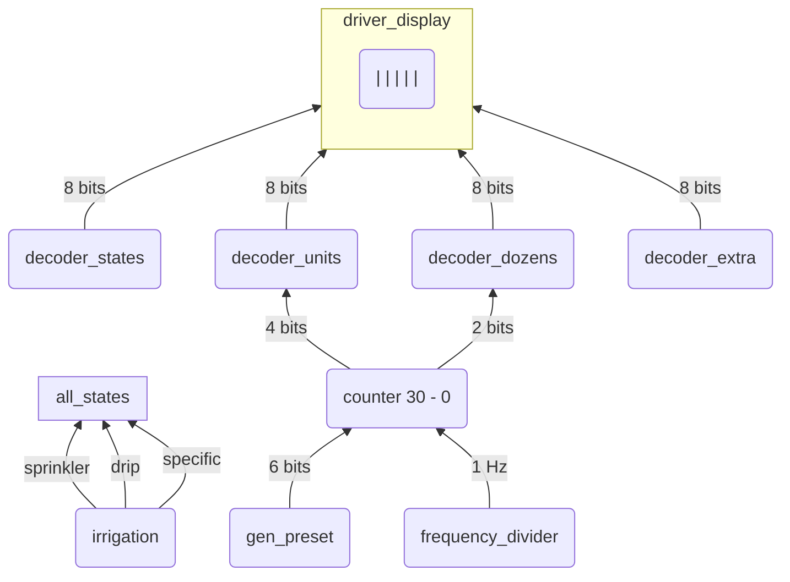

```mermaid
graph BT
    subgraph driver_display
        q0("|  |  |  |  |");

    end

    a(decoder_states);
    a0(decoder_units);
    a1(decoder_dozens);
    a2(decoder_extra);

    b(counter 30 - 0)

    c(gen_preset);

    d(irrigation);

    e(frequency_divider);

    subgraph all_states
    end

    a & a0 & a1 & a2 --"8 bits"--> driver_display;

    b --"2 bits"--> a1;
    b --"4 bits"--> a0;

    c --"6 bits"--> b;

    d --"sprinkler"--> all_states;
    d --"drip"--> all_states;
    d --"specific"--> all_states;

    e --"1 Hz"--> b;

```